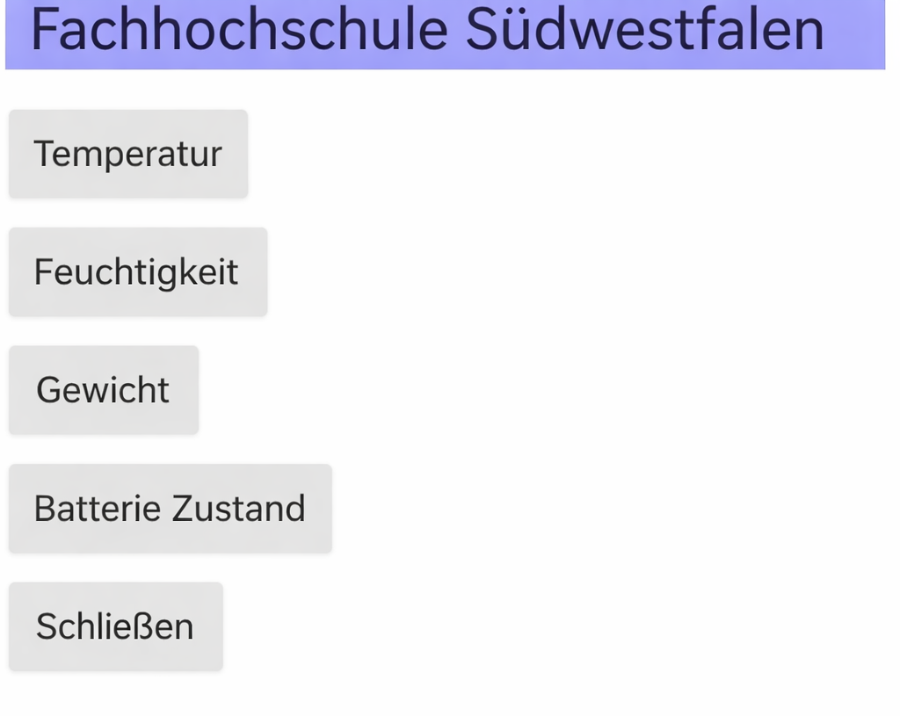

# Entwicklung eines Embedded Systems zur automatischen Messdatenerfassung in Bienenstöcken

Diese Arbeit befasst sich mit der Entwicklung eines IoT-basierten Monitoring-Systems für Bienenvölker. Das System überwacht Klima, Gewicht und Akustik, um die Gesundheit der Bienen zu sichern und die Honigproduktion zu optimieren.

  
   
  <em>Das fertige Monitoring-System mit Aluminiumprofil-Basis und integrierter Steuerelektronik.</em>

## Features & Funktionen
- **Multisensorik:** Präzise Echtzeit-Messung von Temperatur, Luftfeuchtigkeit (DHT22) und Gewicht (HX711).
- **Fortgeschrittene Akustik-Analyse:** Aufzeichnung von Bienengeräuschen mittels I2S-Mikrofon und digitale Frequenzfilterung (200 Hz - 1000 Hz) zur Zustandsüberwachung.
- **Energie-Monitoring:** Integrierte Überwachung des Batteriezustands (SoC) über einen ADS1115 16-Bit ADC.
- **Intelligente Datenlogik:** Event-gesteuerte Übertragung zur Reduzierung des Datenvolumens und Optimierung der Energieeffizienz.

## Hardware-Entwicklung & Design
Ein zentraler Bestandteil der Arbeit war der Übergang vom Breadboard-Prototyp zum finalen Hardware-Produkt:
- **Custom PCB:** Entwurf und Fertigung einer dedizierten Platine mit **KiCAD 8.0**.
- **Gehäusekonstruktion:** Maßgeschneidertes Schutzgehäuse, entworfen in **Autodesk Fusion**.
- **Recheneinheit:** Raspberry Pi 4B als zentrales Gateway.
- **Sensorkomponenten:** SPH0645 (I2S Mikrofon), HX711 (24-Bit Load Cell ADC), ADS1115.

## Software & Cloud-Architektur
- **Programmiersprache:** Python (Modularer Aufbau für Sensorik und Kommunikation).
- **IoT-Integration:** 
  - **ThingSpeak:** Cloud-Visualisierung der Klima- und Gewichtsdaten.
  - **AWS IoT Core:** Sicherer MQTT-Transfer für rechenintensive Audiodaten.
- **Kommunikation:** Nutzung von TCP-Sockets für die Interprozesskommunikation.

## Mobile App (Android)
Die Überwachung erfolgt über eine maßgeschneiderte Android-App. Sie dient als mobiles Dashboard für den Imker und ermöglicht den weltweiten Zugriff auf alle Live-Daten.

  
  
  
   
  <em>Screenshots der mobilen App: Dashboard, Temperaturverlauf und Batteriemonitoring.</em>

## Projektergebnisse
Das System wurde erfolgreich als autarke Einheit realisiert. Durch das eigene Platinenlayout wurde eine hohe Betriebssicherheit erreicht. Die Daten stehen dem Imker weltweit über Dashboards und eine Android-App zur Verfügung.

## Projektstruktur
*   `/software`: Python-Quellcode für Sensorik, Logik und Cloud-Transfer.
*   `/hardware`: Schaltpläne, PCB-Layouts (KiCAD) und 3D-Modelle (STEP).
*   `/images`: Systemfotos und App-Screenshots.
